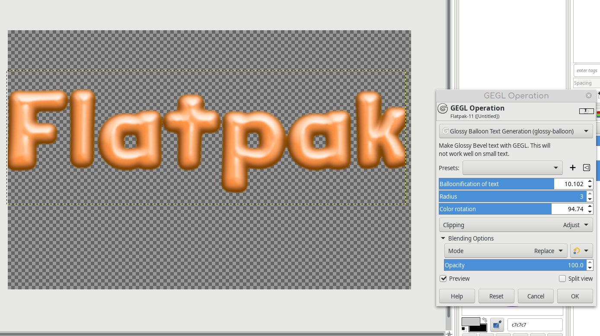

# GEGL-glossy-balloon-text-styling

A new Gimp filter where GEGL makes a glossy balloon effect on your text

You must build zgloss, zglossy2, and glossybevel and put the .so or .dll files in /gegl-0.4/plug-ins/ on Linux click the build_linux.sh or use the 
optional binaries I included. On Windows read this

-

Compiling and Installing
Linux

To compile and install you will need the GEGL header files (libgegl-dev on Debian based distributions or gegl on Arch Linux) and meson (meson on most distributions).

meson setup --buildtype=release build
ninja -C build

If you have an older version of gegl you may need to copy to ~/.local/share/gegl-0.3/plug-ins instead (on Ubuntu 18.04 for example).
Windows

The easiest way to compile this project on Windows is by using msys2. Download and install it from here: https://www.msys2.org/

Open a msys2 terminal with C:\msys64\mingw64.exe. Run the following to install required build dependencies:

pacman --noconfirm -S base-devel mingw-w64-x86_64-toolchain mingw-w64-x86_64-meson mingw-w64-x86_64-gegl

Then build the same way you would on Linux:

meson setup --buildtype=release build
ninja -C build
